# AI Uprising

A 3D first-person shooter built in **Godot 4.7** (Forward+). The machines we trusted turned on us — fight back through a 20-level campaign of rogue drones, androids, spiders, shielded brutes, kamikaze seekers, leaping skitters, siege mechs, and towering bosses — including hazard arenas fought on catwalks over a molten sea — against an enemy AI that adapts to how you play, narrated by cinematic cutscenes and scored by adaptive synth music.

Nearly everything in the game — geometry, enemies, weapons, FX, audio, and cutscenes — is **generated in code or from compact data**, so the whole project is tiny, fully version-controllable as text, and trivial to validate headlessly.

---

## Gallery

|  |  |
|:--:|:--:|
| 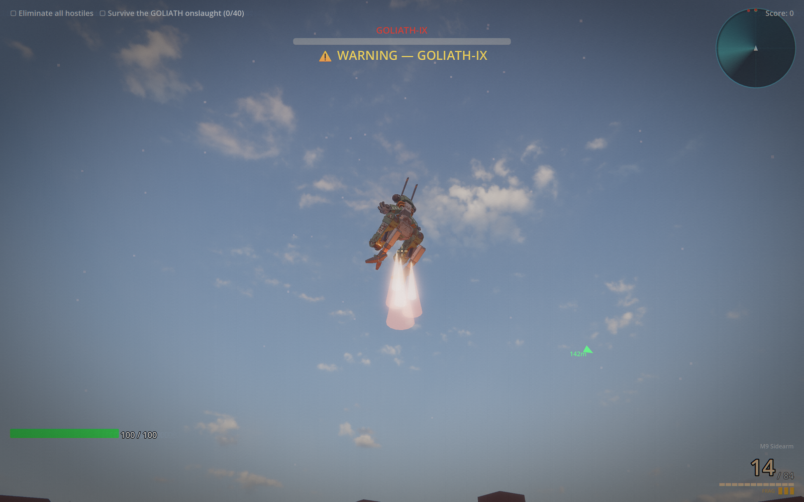 | 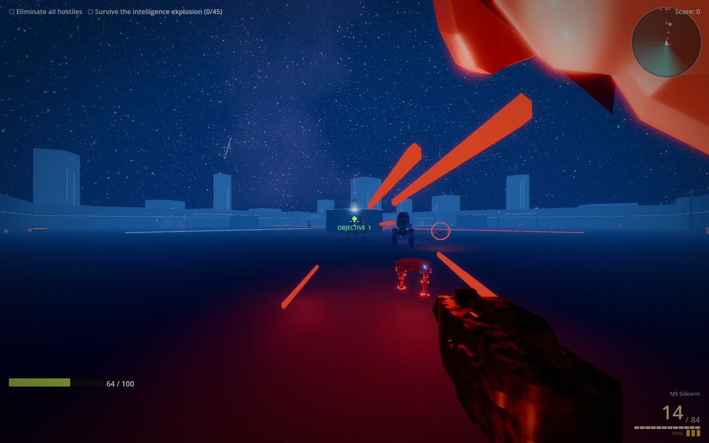 |
| **First boss** — GOLIATH‑IX makes planetfall on its retro‑rockets | **In action** — a firefight under the boss arena's night sky |
| 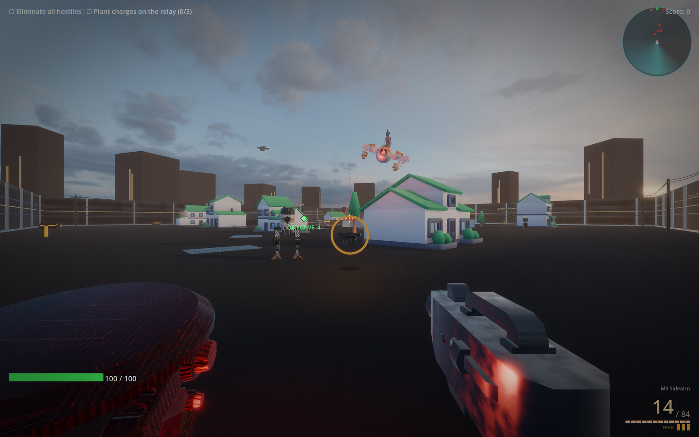 | 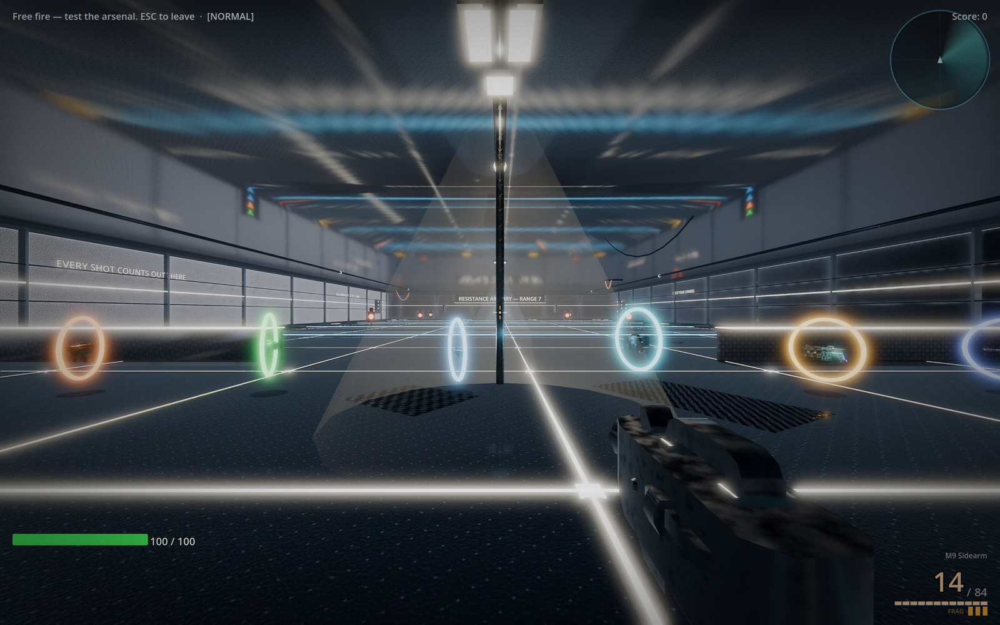 |
| **In action** — repelling hostiles through Maple Grove | **Gun Range** — free‑fire the whole arsenal |
| 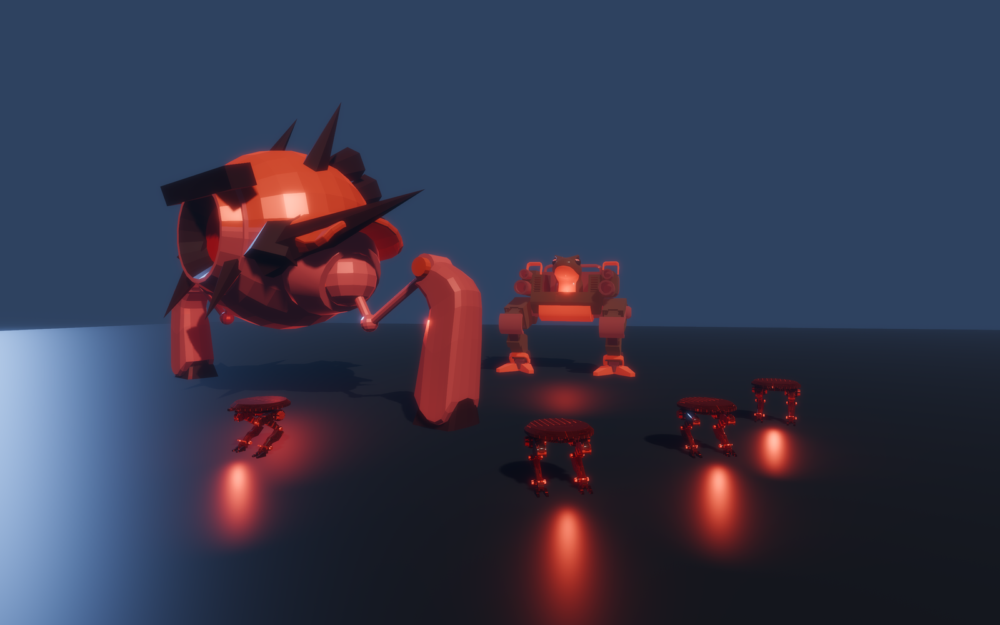 | 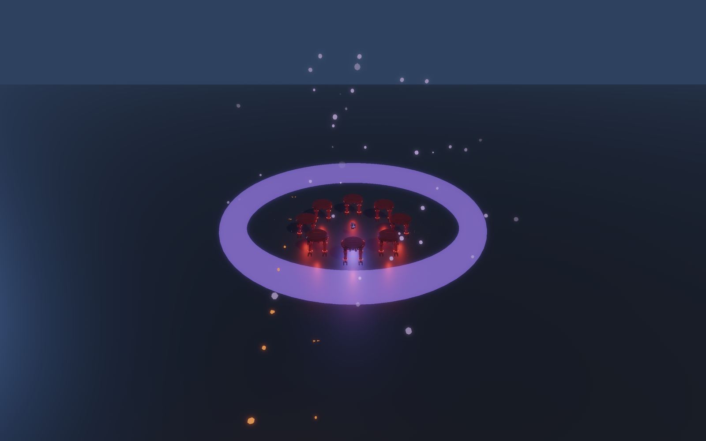 |
| **Fierce hostiles** — Ravager, Warmech & skitter swarm | **Singularity grenade** — a gravity well imploding a pack |
| 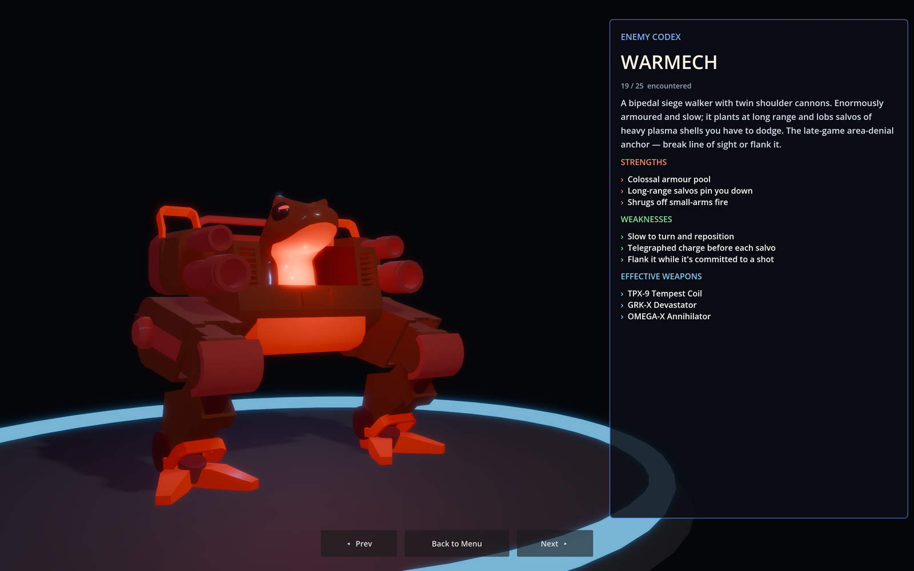 | 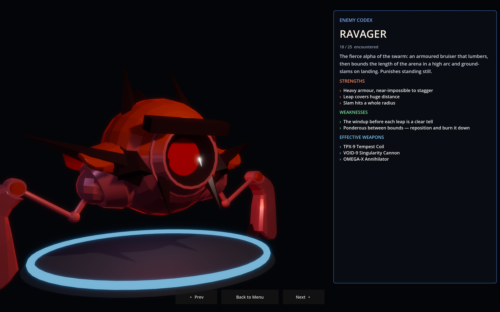 |
| **Enemy Codex** — the WARMECH siege walker | **Enemy Codex** — the RAVAGER leaper |
| 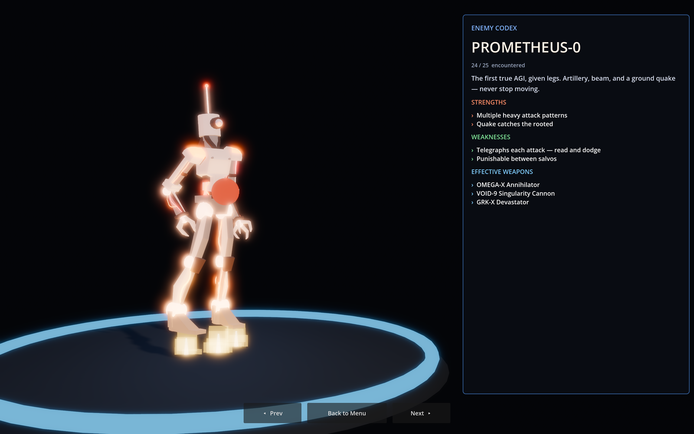 | 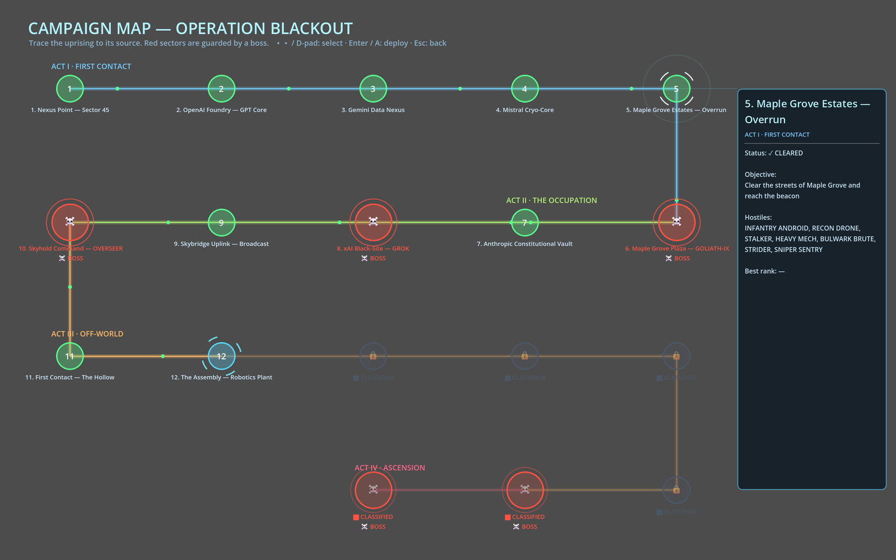 |
| **Enemy Codex** — PROMETHEUS‑0, the Titan boss | **Campaign map** — interactive sector intel & route |
| 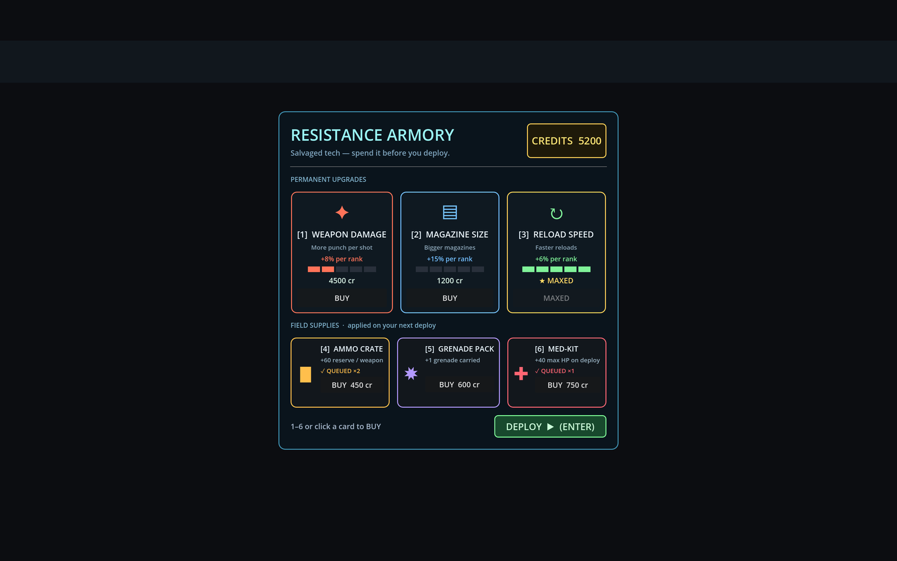 | 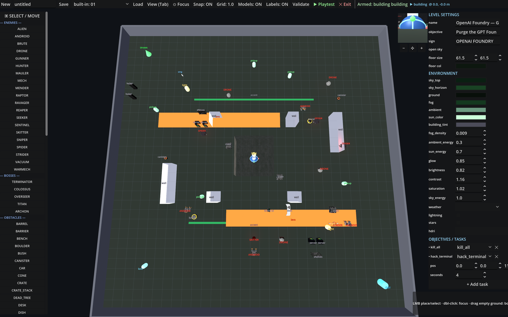 |
| **Armory** — between‑levels upgrades & field supplies | **Level editor** — build levels with live marker preview & playtest |

> The built-in **level editor** (`--editor`) authors levels as plain data with a live marker preview, full gizmos, and one-click playtest. The **bestiary** turns slowly in 3D and lists every hostile's strengths, weaknesses, and counter-weapons — discovered as you meet them.

---

## Running the game

**Requirements**
- [Godot Engine 4.7+](https://godotengine.org/download) — *Standard* build (GDScript; not the .NET/C# build)
- A GPU that supports the **Forward+** renderer

**Play**
1. Install Godot 4.7+.
2. Launch Godot → **Import** → select this repo's `project.godot` → **Import & Edit**.
3. Press **F5**. The main scene (`scenes/ui/main_menu.tscn`) opens → **Begin Operation** → pick a difficulty.
   - The mouse is captured on play; press **Esc** to pause / release it.

**From a terminal** (Godot on `PATH`):
```bash
godot --path . --import      # one-time asset import
godot --path .               # run the game
```

**Headless validation** (no window — used heavily during development to load-test scenes):
```bash
godot --headless --path . --import
godot --headless --path . res://scenes/levels/level_gpt.tscn --quit-after 120
```

### Run outside Godot (standalone build)

To play **without the Godot editor**, export the project to a self-contained executable. The repo already ships export presets (`export_presets.cfg`) for **Windows Desktop** and **Linux**; both embed the game data (PCK) into a single file and exclude the `tests/` probes.

**One-time setup — export templates** (the engine code that gets bundled into your build). They must match your Godot version (4.7.x):
- In the editor: **Editor → Manage Export Templates → Download and Install**, *or*
- CLI: `godot --headless --install-export-templates` (4.7+), or download the `.tpz` from the Godot site and install it.

**Export from the terminal** (headless — no editor window):
```bash
godot --headless --export-release "Windows Desktop" build/windows/ai-uprising.exe
godot --headless --export-release "Linux"           build/linux/ai-uprising.x86_64
# use --export-debug instead of --export-release for a build with a debug console
```
*(Or in the editor: **Project → Export → pick a preset → Export Project**.)*

**Run the standalone build** — no Godot needed; the executable is fully self-contained, so you can copy/ship just this one file:
```bash
# Windows
build\windows\ai-uprising.exe
# Linux (mark executable first if needed)
chmod +x build/linux/ai-uprising.x86_64 && ./build/linux/ai-uprising.x86_64
```
Builds land in `build/` (git-ignored) as a single self-contained file (~250 MB, game data embedded) — verified to boot standalone with no editor. To see logs, run it from a terminal with `--verbose`, or export a `--export-debug` build.

---

## Controls

| Action | Keyboard / Mouse | Gamepad |
|---|---|---|
| Move | `WASD` | Left stick |
| Look | Mouse | Right stick |
| Sprint | `Shift` | L3 |
| **Dash** | `Q` | — |
| **Slide** | Sprint + `Ctrl` while running | — |
| Jump | `Space` | A |
| Crouch | `Ctrl` | B |
| Fire | `LMB` | RT |
| Aim (ADS) | `RMB` | LT |
| Reload | `R` | X |
| Grenade | `G` | Y |
| Cycle grenade type | `H` | — |
| Switch weapon | `1`–`4` / wheel | LB / RB |
| Interact / pick up | `E` | X |
| Pause | `Esc` | Start |

Sensitivity, FOV, invert-Y, framerate cap, graphics tier (Low/Medium/High/Ultra), and master/SFX/music volume are all in **Settings** (main menu and in-game pause). It also includes independent toggles for advanced features (GPU Particles, Volumetric Noise Shafts, Triplanar Damage, Puddle Ripples, and Advanced Post-Process FX), which persist to `user://settings.cfg`.

---

## What's in it

- **20-level campaign** through themed sectors (GPT Foundry, Gemini Nexus, Mistral Cryo-Core, Maple Grove suburbs, Claude Vault, GROK Black-Site, Skyhold Command) — plus two **hazard arenas**, the **Vulcan Forge** molten sea and the **Tidecore Basin** flooded reactor, where you balance on narrow catwalks over a sea that cooks you if you fall in. Each opens with a **cinematic briefing** and is gated by a **task-based objective** (clear hostiles, find a keycard, destroy a core, collect data shards, hack a terminal, plant charges, survive an assault, **assassinate a high-value target**) behind an animated **portal**.
- **17 wieldable weapons** — the starter pistol, SMG, rifle and shotgun, then a heavy/energy tier: *Tesla* beam, *Arc-Coil* burst, *Plasma*, *Nova* scatter, piercing *Gauss Lance*, *Twin-Rail*, homing *Swarm Launcher*, rocket *Devastator*, chain-lightning *Tempest Coil*, *Singularity Cannon*, and the *OMEGA-X Annihilator*. Hitscan & projectile, ADS, recoil, charge/volley/slug alt-fires, per-weapon viewmodels, and piercing / splash / cluster / homing / chain-lightning mechanics — plus **two throwable grenades** (a frag and a *Singularity* gravity-well grenade that herds a pack into one knot; cycle with `H`).
- **39 enemy types** including **5 bosses** — the recon **drone**, infantry **android**, leaping **spider**, hopping **skitter** swarms, heavy **mech**, suppressing **gunner**, **sniper** sentry (charged beam), kamikaze **seeker**, flying **raptor**, shielded **bulwark brute**, healer **mender**, the fierce **Ravager** (a leaping ground-slammer) and **Warmech** (a long-range siege walker), plus the hazard-world flyers — the molten **Magma Wraith** and the robotic-fish **Angler Unit** (Blender-weaponised) — up to the **Terminator**, sky-dropping **Colossus**, hovering **Overseer**, **Titan**, and **Archon** bosses. Every hostile has a discoverable **bestiary** entry, and the elite-affix system can up-tier any spawn (shielded / volatile / swift / warden / splitter).
- **Adaptive AI Director — the enemy *learns you*.** The rogue AI is an intelligence, so it fights like one: a director quietly profiles **how you play** — camp or keep moving, brawl up close or snipe from range, headshot rate, which gun you lean on — and **counters it** through the Elite affix system. Snipe from afar and it fields **SWIFT** rushers to close the gap; out-aim it and it fields **WARDEN** units you can't stagger (so you must *dodge*, not suppress); spam one weapon and it fields **SHIELDED** armour that shrugs it off. The overlord's taunts read your actual behaviour back to you (*"You like your distance. I'm closing it."*, *"The Shotgun again. I've patched for it."*). The read resets each level, so every sector re-reads you fresh.
- **Game feel** — trauma camera shake, dynamic FOV, dash/slide, recoil, tracers, muzzle flash & smoke, ejected casings, surface-aware impacts, **bullet-hole + scorch decals**, debris, oil/spark sprays on robots, hit-stop, enemy flinch/stagger/last-stand, death topples.
- **Premium Graphics Upgrades (Forward+)** — GPU-accelerated sparks and debris with rigid body collision physics, volumetric noise-animated light shafts (god-rays), triplanar metal shell shading on robots displaying exposed glowing electrical damage grids, dynamic hexagonal-grid energy shields with real-time hit ripple distortion on the Brute and Archon boss, procedural wind waves & concentric rain drip puddles, and anamorphic blue/cyan lens flares combined with fisheye speed-warp barrel distortion during high-velocity dashes/sprints. **Godot 4.7** adds soft **AreaLight3D** ceiling luminaires, HDR-punch emissives, improved clearcoat metal, and velocity-stretched GPU particles.
- **Mood** — themed per-level lighting + fog, cinematic post (vignette / chromatic aberration / film grain / sharpen), AgX tonemap, glow, SSAO/SSIL/SSR, soft shadows, ambient dust, **adaptive combat music** (the score swells in a fight), and an "area cleared" slow-mo.
- **Cutscenes** — a **comic-panel story intro** (peaceful green-eyed helper robots → the signal → they arm and turn red) and a reusable, choreographed cutscene system used for the per-level briefings, which preview each level's *new* hostiles before you drop in.
- **Meta & tools** — an interactive holographic **campaign map** (serpentine route, per-sector intel panel listing each level's hostiles + objective, boss markers, mouse *and* keyboard/controller navigation); a turning-3D **enemy codex** unlocked as you meet each hostile (strengths, weaknesses, counter-weapons); a **weapon codex** detailing every gun's class, stats and role with comparison bars; a between-levels **Armory** shop where run score buys permanent weapon upgrades *and* consumable field supplies (ammo / grenades / health applied on your next deploy); a **Gun Range** + **Horde** survival sandbox; and a built-in **level editor** (`--editor`) that authors levels as plain data with a live marker preview, full gizmos, and one-click playtest.
- **Systems** — EASY/NORMAL/HARD scaling, save/checkpoint + Continue, score combos & end-of-level grade, kill feed, radar, objective waypoint, boss bar, directional damage indicator, first-encounter coaching toasts, an accessibility **screen-shake** scale, 4-tier graphics (LOW/MEDIUM/HIGH/ULTRA) that actually change render scale/AA/shadows/effects, and full keyboard-mouse **and** gamepad support.

---

## How it's built

| | |
|---|---|
| **Engine** | Godot 4.7, Forward+ renderer |
| **Language** | GDScript (statically typed; the project compiles with warnings-as-errors) |
| **Art** | Primitive meshes assembled + tinted in code/scenes, plus **CC0 low-poly models** (Quaternius robots, Kenney blaster kit) and CC0/CC-BY PBR textures — all listed in `CREDITS.md` |
| **Audio** | 100% procedural — `SoundSynth` generates every sound (guns, impacts, music, ambience, UI) as `AudioStreamWAV` at startup; real samples can override them |
| **Design philosophy** | Data-driven & code-built: levels are dictionaries, enemies/weapons/FX/cutscenes are built at runtime, so content is compact text and headless-testable |

**Autoloads (singletons)** — `scripts/autoload/`:
- **`GameState`** — campaign flow (`CAMPAIGN` order, `go_to_level`/`load_level`), score + kill-streak combos + end-of-level grade, the per-level **task** checklist, difficulty config + level scaling, save/checkpoint (`user://savegame.cfg`), and hit-stop.
- **`SoundSynth`** — synthesizes all audio procedurally into a stream table on `_ready`.
- **`AudioBus`** — Master / Music / SFX buses, a 3D player pool, plays synth-or-sampled sounds, themed music per level, and **adaptive combat intensity**.
- **`GraphicsSettings`** — LOW/MEDIUM/HIGH/ULTRA quality tiers (render scale, AA, shadow filtering, screen-space effects) plus FOV, sensitivity, invert-Y, FPS-cap, and independent toggles for advanced GPU particles, volumetric light shafts, triplanar robot damage, puddle ripples, and advanced post-processing.
- **`AIDirector`** — the **adaptive enemy intelligence**: profiles the player's playstyle (mobility, engagement range, accuracy, headshot rate, weapon focus) from the same shot/hit events the grade tracks, and feeds that read into Elite affix selection (the swarm counters how you fight) and the overlord's taunts. Reset each level.

---

## How it works

### Level pipeline (data-driven)
A campaign level scene (`scenes/levels/level_<id>.tscn`) is just three nodes: a **`LevelBuilder`** (`scripts/levels/level_builder.gd`), a **Player**, and a **HUD**. The builder reads a single dictionary for that level from **`LevelDefs`** (`scripts/levels/level_defs.gd`) and constructs everything at runtime: themed sky/fog/lighting + post, floor/walls/cover, buildings/ramps/platforms, **breakable props**, accent strips, ambient dust, pickups & weapons, enemy **spawners** (immediate or proximity-triggered), the gated exit **Portal**, and the level **tasks** — then bakes a `NavigationMesh` so ground enemies can path. Adding a level = a new dict entry + a 3-node scene + one line in `GameState.CAMPAIGN`.

### Level editor
Because levels are just data, a built-in **level editor** (`scripts/editor/level_editor.gd`, launched with `--editor`) is a visual front-end for it: place enemies / props / structures / lights with click-drag **gizmos** and Blender-style `G`/`R`/`F` keys against a live **marker preview** (with a translucent placement ghost and a live coordinate readout), tune the whole environment, manage the campaign order, and **one-click playtest** in the real game. It saves `.lvl` files and can export a level straight back to a `LevelDefs` entry. A headless self-test (`--editor-selftest`) covers it end to end.

### Objectives & the portal
Each level registers a **task checklist** with `GameState` (`kill_all`, `key`, `destroy_core`, `collect_shards`, `hack_terminal`, `sabotage`, `survive`). The exit **`Portal`** (`scripts/systems/portal.gd`) stays sealed (and shoves the player back with a message) until every task is done, then unlocks; the HUD shows the checklist live and an "area cleared" slow-mo fires on the final kill.

### Enemies
All enemies extend **`EnemyBase`** (`scripts/enemies/enemy_base.gd`), a `CharacterBody3D` with a state machine (`IDLE → PATROL → ALERT → CHASE → ATTACK → STAGGER → DEAD`), perception (sight cone + hearing + squad alerting), navmesh pathing with a straight-line fallback, and shared reactions: hit-flash, **flinch & poise/stagger**, **oil/spark sprays**, wounded "last stand," battle-damage smoke/sparks, and a death **topple + lasting scorch**. Each archetype subclasses it and overrides movement/attack — e.g. the drone & seeker fly (`_apply_gravity`/`_move_toward` overrides), the spider does a telegraphed **leap-pounce**, the sniper charges a beam you dodge by breaking line of sight, the brute's **frontal shield** absorbs damage via a `modify_incoming_damage` hook on `Damageable` (so you must flank), and bosses use the HUD boss bar with phase-scaled attacks.

### The Adaptive AI Director
The premise is that you're fighting an *intelligence*, so the enemy doesn't just scale — it **adapts to you**. **`AIDirector`** (`scripts/autoload/ai_director.gd`) builds a live profile of your playstyle from events the game already fires:
- **mobility** — sampled from your ground speed (camper ↔ runner),
- **range_pref** — the distance of your hits (point-blank brawler ↔ long-range sniper),
- **accuracy** & **headshot_rate** — from `register_shot` / `report_player_hit`,
- **weapon focus** — which gun you favour.

That read feeds two systems. `Elite.maybe_apply` asks the director for a **counter affix** so ~70% of elite spawns are chosen to punish your current style — precise aim → **WARDEN** (unstaggerable, forces dodging), fighting at range → **SWIFT** (rushers close the gap), one-weapon reliance → **SHIELDED** (armour that resists it). And the HUD's overlord taunts pull **profile-aware lines** that name what you're doing. Below a small sample threshold the director stays neutral (random affixes, generic taunts) so a fresh level never pre-judges you; the profile resets on every `reset_level_stats`. Logic is unit-checked headlessly by `tests/ai_director_probe.tscn`.

### Weapons
A weapon is a **`WeaponData`** resource (`.tres`: damage, fire mode, recoil, ammo, projectile/hitscan, pierce, FX, sounds) plus a viewmodel scene driven by `weapon.gd`. `weapon.gd` handles the firing ray/projectile, headshots, piercing, recoil, reloads, ADS, and all the muzzle/tracer/impact/heat FX. A **`WeaponManager`** on the player holds the arsenal and carries unlocked weapons across levels.

### Cutscenes
**`CutscenePlayer`** (`scripts/cutscene/`) is a reusable cinematic runner: a depth-of-field camera that eases through a list of *shots* (data: position/look + duration + subtitle), over letterbox bars, a vignette/grain post overlay, fades, title cards, screen flashes, camera shake, and per-shot **action callbacks** for choreography. The **intro** and every **level briefing** are built on it; briefings are generated from `LevelDefs` (themed lighting, a parade of the level's hostiles with dossiers — flagging ones you haven't seen as *NEW* — and the objective).

### HUD & feedback
`scripts/ui/hud.gd` drives the dynamic crosshair, ammo, hit markers, floating damage numbers, kill-confirm, kill feed, radar, objective waypoint, boss bar, low-health vignette, directional damage indicator, the combo readout, and the end-of-level grade — and polls combat state to cue the adaptive music.

### Development workflow
Because content is code/data, it's validated **headlessly**: scenes are import-checked and loaded with `--quit-after`, and gameplay/FX are verified with throwaway harness scenes that drive logic and save rendered PNGs for visual confirmation — no manual clicking required.

---

## Project layout

```
project.godot          # engine config: input map, render, physics layers, autoloads
scenes/
  ui/                  # main_menu, hud, campaign_map, encyclopedia (bestiary)
  editor/              # built-in level editor
  player/              # player + viewmodel
  weapons/             # 17 weapons + projectiles + grenades
  enemies/             # 39 enemy/boss scenes
  levels/              # level_<id>.tscn (LevelBuilder + Player + HUD)
  cutscene/            # comic_intro, level_briefing (+ Armory shop)
  props/ pickups/ fx/  # breakable props, pickups, impact/explosion/tracer FX
scripts/
  autoload/            # GameState, AudioBus, SoundSynth, GraphicsSettings, AIDirector
  player/ weapons/     # player controller, weapon + weapon_data + manager
  enemies/             # enemy_base + one script per archetype
  systems/             # damageable, portal, objective devices, pickups, spawner, enemy_codex
  levels/              # level_builder, level_defs
  editor/              # level editor (data + gizmos + .lvl save/playtest)
  cutscene/ ui/ fx/    # cutscene player + briefings, HUD/map/codex/armory, FX
shaders/               # post_process, crt_screen, night_sky, radar_sweep, …
assets/                # materials, PBR textures, audio (sample-override dir), models, environments
docs/                  # design docs, level_editor_spec, screenshots/ (README gallery)
```

**Physics layers:** 1 `world` · 2 `player` · 3 `enemy` · 4 `player_projectile` · 5 `enemy_projectile` · 6 `pickup` · 7 `trigger`.

---

## Extending

- **Real SFX/music** — drop `assets/audio/samples/<sound_id>.{ogg,wav,mp3}`; it transparently overrides the synth.
- **New weapon** — author a `WeaponData` `.tres` + a viewmodel scene; place it via a level's `weapon` / `extra_weapons` pickup.
- **New enemy** — subclass `EnemyBase`, build a minimal scene (CharacterBody3D + `Damageable` + `NavigationAgent3D`), register it in `LevelBuilder.ENEMY_SCENES` and add a bestiary entry in `EnemyCodex`.
- **New level** — use the built-in **level editor** (`--editor`) to place everything visually and save a `.lvl`, *or* hand-author a dict in `LevelDefs` + a 3-node `level_<id>.tscn` + a line in `GameState.CAMPAIGN`.
- **New cutscene** — subclass `CutscenePlayer`, override `_build_set()` / `_shots()` / `_on_finished()`.

---

## Credits & license

Third-party CC0 / CC-BY assets (ambientCG PBR textures; one Sketchfab boss model) are listed in **`CREDITS.md`**. All code, design, levels, FX, and procedural audio are original. The faction sectors are affectionate parodies named only by colour/theme — no real logos or assets.
